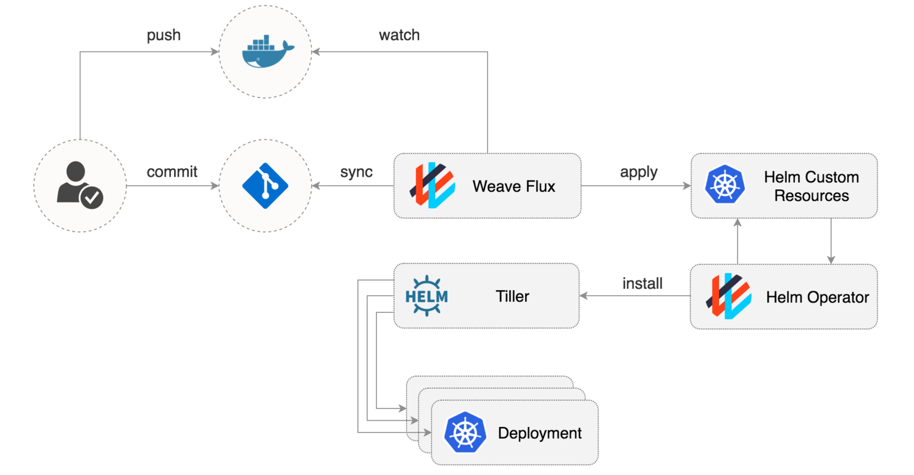

# Deployment Configuration
Deployments are done using [Flux](https://github.com/weaveworks/flux) and [Helm](https://helm.sh). Flux is configured to monitor this Git repository for changes. When changes are detected, Flux will read the Kubernetes YAML files in the configured repository location and apply them to the Kubernetes cluster.

## Directory Structure
Each namespace used by your project has its own instances of Flux and Helm that is monitoring a specific folder within this repository. Instances are configured to look at `deployment-config/{cluster}`. For example the `Dev` cluster looks at `deployment-config/dev`.

## How Deployments Work
The CI/CD pipeline will produce a container image for your application and push that image to the Image Repository. Flux picks up from there, to handle deploying that image to Kubernetes.

Flux is a tool that automatically ensures that the state of a cluster matches the config in git. It uses an operator in the cluster to trigger deployments inside Kubernetes, which means you don't need a separate CD tool. It monitors all relevant image repositories, detects new images, triggers deployments and updates the desired running configuration based on that (and a configurable policy).

### Promotion
Promotion of the application, and its associated configuration, is done by modifying the object YAML files associated with the target environment. For the Development cluster, developers will push changes to the `development` branch this config repository. This will trigger Flux to apply the changes to the associated namespace(s). 

For promotion to the Staging and Production clusters, a PR targeting the `master` branch is opened containing the requested changes. This PR will be reviewed and applied by the ProdOps team. The Flux instance(s) running in those environments will then apply the changes to the `master` branch to the associated namespace(s).

### Automating Deployments
Flux supports a number of ways to detect app and configuration changes and automate the deployment of those changes. To do this, Flux uses a set of [Annotations](https://github.com/fluxcd/flux/blob/master/docs/references/fluxctl.md#using-annotations):
* `flux.weave.works/automated:` - Setting this annotation to true, enables Flux automation for the associated object.
* `flux.weave.works/tag.{container-name}:` - Automates the update of pod deployments based on image tag filtering. The annotation `{container-name}` portion of the tag is replaced with the name of your container name. If using in a HelmRelease objects, `flux.weave.works/tag.chart-image` should be used.