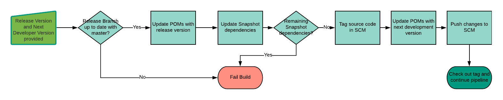

## Release Pipeline
When the pipeline is manually triggered and a release version number is provided this pipeline will handle tagging the codebase, building the release build.

1. **Check against Master branch** 
Check the branch being released against master for any commits that are missing on the release branch. This could occur if there are hot-fixes that were not merged into the release branch. Fail the build if there are missing commits.
1. **Update POMs with release version** 
Update the POM files in your project to use the given release number.
1. **Update SNAPSHOT dependencies** 
If there are any SNAPSHOT dependencies, attempt to update them to their release versions.
1. **Check for SNAPSHOT dependencies** 
Check to make sure there are no remaining SNAPSHOT dependencies. Fail the build if any are detected.
1. **Tag the Source Code** 
Create a tag in source control for the release
1. **Set Development Version** 
Set the next development version in the POM files.
1. **Push changes to SCM** 
Push these local changes to the source code repository.
1. **Checkout the tag** 
Checkout the newly created tag. Use that as the basis for the rest of the pipeline execution.
1. **Continue the build pipeline stages** 
Continue the build pipeline stages in the [Gitflow Pipeline](README.md)

## Pipeline Output
This portion of the build pipeline results in the following artifacts:
* Version Number Tag in SCM at capturing the state of the release branch at the time of this build.